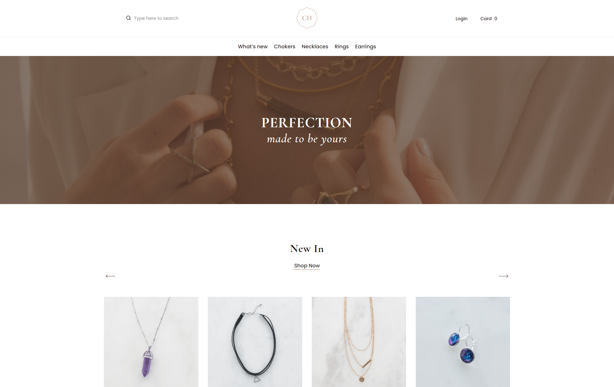

# Jewellery: accelerator #3 [[HTML Academy]](https://htmlacademy.ru/)

### 📋 Проект акселератора #3: Многостраничный сайт (Старт 04.06.2021 - Дедлайн 24.06.2021)
🔗 URL: [accelerator-level-3-jewellery.vercel.app](https://accelerator-level-3-jewellery.vercel.app/)
### 
### 

* Менеджер: [Софья Дышпан].
* Тестировщик: [Евгения Рябикова].
* Наставник: [Виктор Гирда].
* Исполнитель: [Антон Решетников].

<br clear="both">

<div>
  
</div>

### 🛠 Технологии:
- Pug
- Sass
- Java Script (ECMAScript 6)
- Gulp, Webpack

### 💡 Описание:
Учебный проект, в рамках которого оттачил практические навыки, полученные во время учебы. Так же данный проект являеться <em>Третим</em> шагом в грейдировании, перед оплачиваемой стажировкой в аутсорс компании ООО "Ракета" (Лига А).<br>
Основной функционал включает:
- Адаптивная, валидная верстка.
- Якорные ссылки и скрол по клику к ним.
- Векторная графика.
- Форма обратной связи. Валидация формы.
- Различные блоки.
- Модальное окно с формой авторизации.
- Табы, слайдеры, аккордеоны.
- Хлебные крошки, пагинация на странице с товарами.
- Фильтр по таварам.
- Динамический адаптив (позволяет перемещать необходимые блоки на заданных разрешениях в другие блоки и обратно).

### Основные команды для работы:

- Установка 
```
npm i
```

- Запуск локального сервера без минификаций
```
npm start
```

- Сборка проекта, минификация скриптов <br>
и оптимизация изображений перед деплоем на прод
```
npm run build
```

- Сборка проекта, без минификации
и оптимизация изображений перед деплоем на прод
```
npm run nomin
```

- Запуск тестирования на соответствия кодгайдам
```
npm test
```

- Создание webp изображений в директории source
```
npm run webp
```

- Создание avif изображений в директории source
```
npm run avif
```

- Оптимизация картинок (png, svg, jpg)
```
npm run optimize
```

### Вся разработка ведётся в директории `source`
### Итоговый код попадает в директорию `build`

